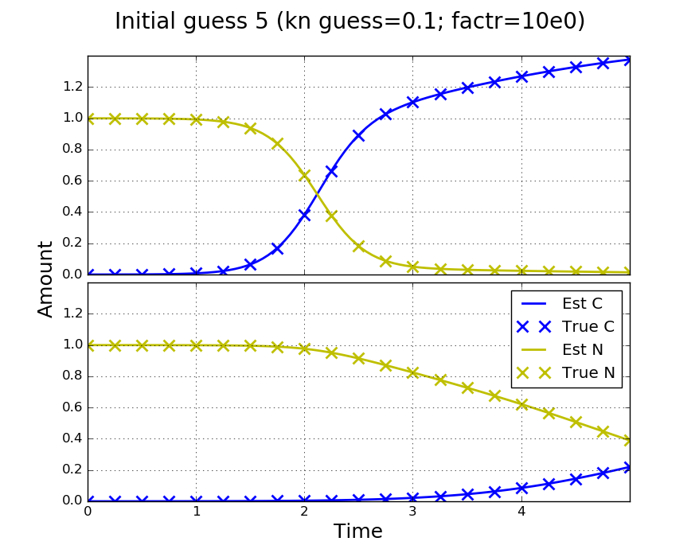
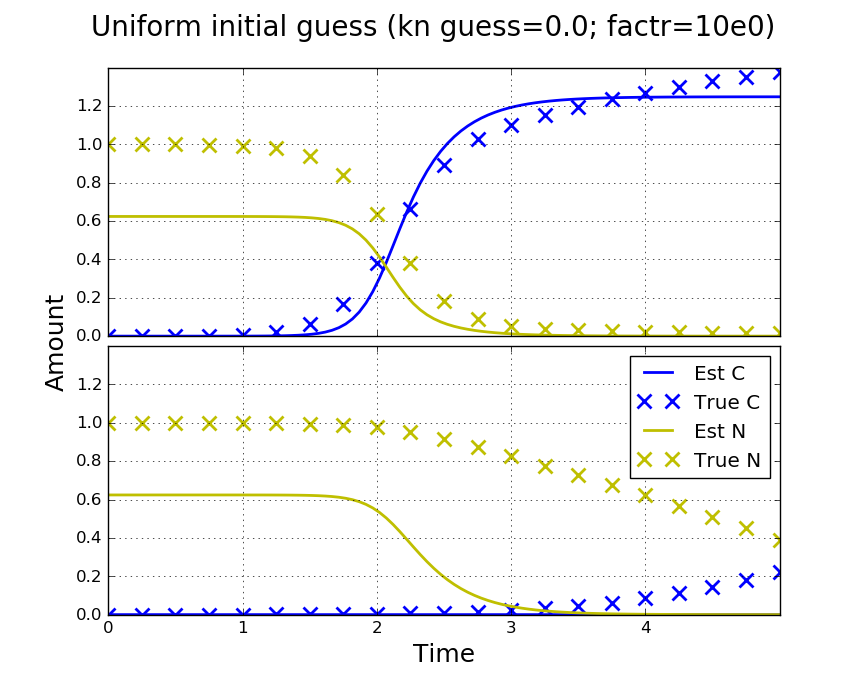
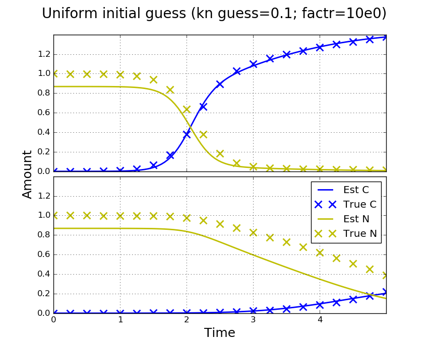
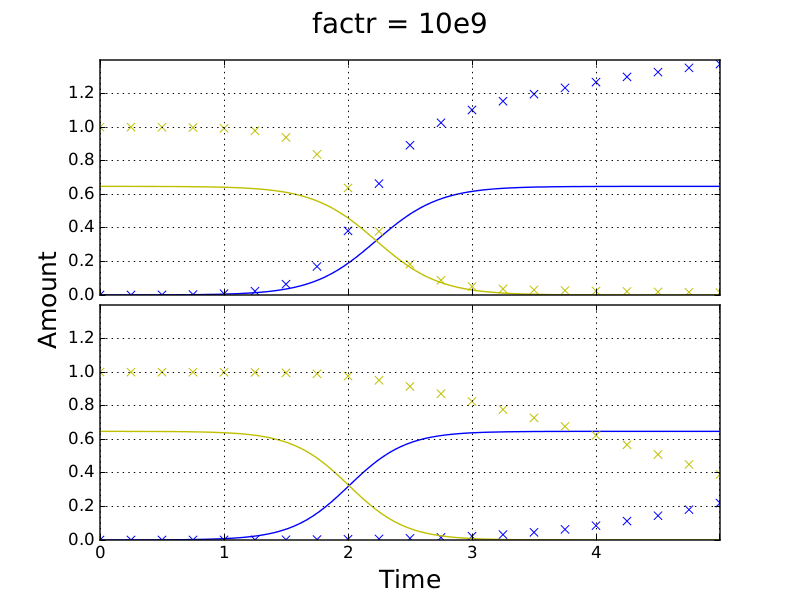
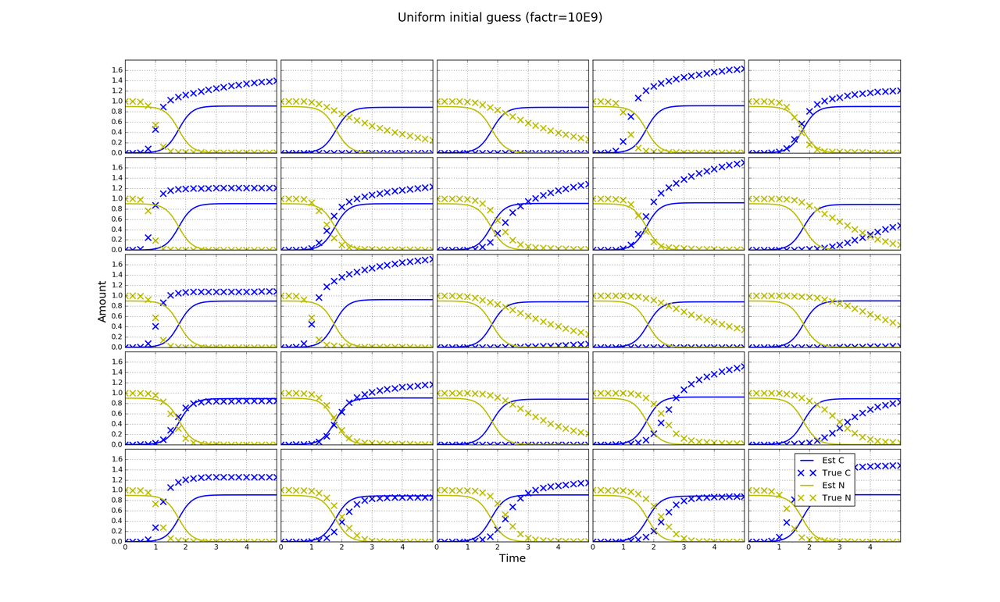
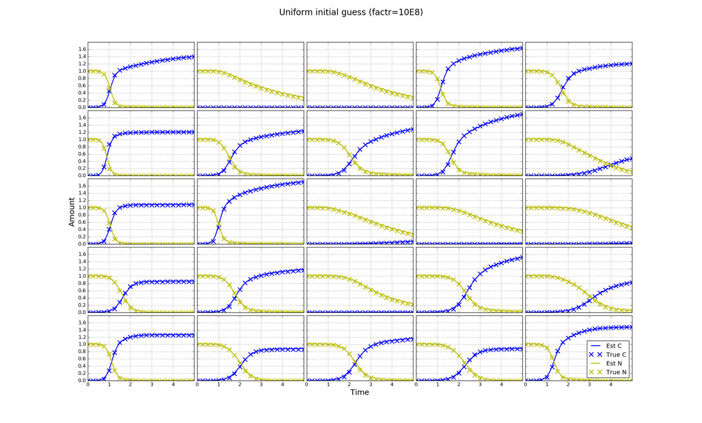
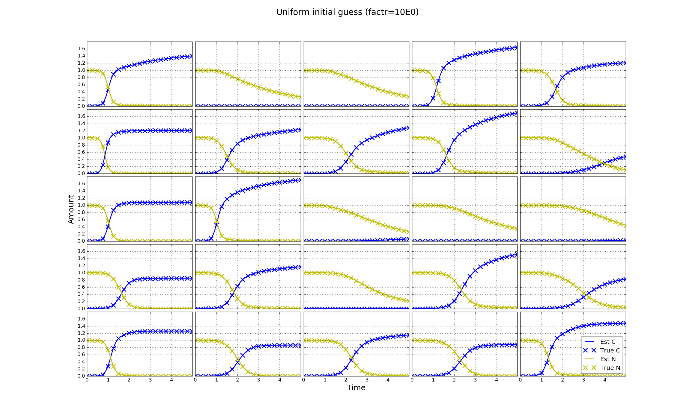

.. title: Fit a 16x24 Competition Simulation
.. slug: fit-a-16x24-competition-simulation
.. date: 2016-05-14 14:12:16 UTC+01:00
.. tags: 
.. category: 
.. link: 
.. description: 
.. type: text

Outline
=======

This time we fit the competition model to plates also simulated using
the competition model with kn > 0.

Plan
====

Simulation
----------

We want to fit a full plate simulation of the competition model using
the competition model. We use some information that we will not have
for real data. For instance, we use the same N(5, 3) distribution to
genereate rate constants for the simulation and initial guesses for
fitting. We aim to determine sensible stopping criteria for the
minimizer, how many initial parameter guesses we will need to make to
find the correct minimum and how long fitting will take.

Becuase there is a large number of cultures on the plate (384), one
set of random growth constants should do for simulated data. For 3x3
plates, we have :doc:`previously shown <use-inde-est-as-comp-guess>`
that, using enough random initial guesses of growth constants, we can
achieve good fits over a range of kn values. Therefore, we will just
use one value for kn and one simulated data set.

Real Data
---------

We will not know how realistic values of test parameters are, or
whether the model can even produce a good fit, until we try fitting
real data. If, in fits of real data, some parameters are much smaller
than others then we may have to scale them to be of roughly the same
order of magnitude in order for the minimizer to work. We may also
have to use many more initial parameter guesses from different
distributions to achieve a first fit. After this we will have ball
park values which we can use.

To reduce computation time we will first fit a central 5x5 or 4x4
section of a real plate. To reduce errors due to not fitting the
entire plate, we will discard edge cultures and assess the inner 3x3
or 2x2 fit. We can use the results of this fitting to calibrate for
full plate fitting.

Results
=======

I simulated a full 16x24 plate and generated 100 sets of random
~N(5, 3) guesses for rate constants r which were annotated and saved
to file.

2x1 Fits
--------

I took the parameters from a 2x1 zone of the full plate. Coordiates of
the top left culture of the zone are (7, 13) with the origin of the
plate being (0, 0). I used these parameters and the competition model
to simulate new amounts as if the zone was not part of the larger
plate. I fitted the competition model to the simulations using ten of
the sets of random r guesses as initial guesses. To be consistant I
used the r guesses corresponding to the zone.

Effect of initial guess of kn
+++++++++++++++++++++++++++++

At first I used an initial guess for kn of 0.0. This produced
relatively poor fits. Contrary to :doc:`previous findings
<use-inde-est-as-comp-guess>`, where different parameters were used
for simulating data, the initial guess of kn is importatant. Here,
parameters were changed to better match experimental growth times
which are typically around 5 days. A value of kn = 0.1 as an initial
guess improves fits (the true value is 0.2).

Initial guess 5:

========== ====== ================ ================
Parameter  Truth  Est kn_guess=0.0 Est kn_guess=0.1
========== ====== ================ ================
C_0        1.0E-4 3.63E-5          9.91E-5
N_0        1.0    0.94             0.9994
kn         0.2    0.28             0.2006
r0         4.350  5.2              4.357
r1         1.859  2.4              1.864

obj fun    na     3.6E-2           3.7E-4
========== ====== ================ ================

I also made fits using a uniform guess of rate constants r_i = 5.0
(the true distribution mean). Fits were again dependent on the kn
initial guess and not as good as for the best random guess. We only
fit to the simulated number of cells observations (blue crosses). In
the right plot below a fairly good fit is made to the cell timecourse
even though the starting nutrient amount is poorly estimated. This
affects other parameters as can be seen in the table. However, we can
distinguish the better fit for inititial guess five by the value of
the objective function which is two orders of magnitude smaller.

Uniform initial guess:

========== ====== ================ ================
Parameter  Truth  Est kn_guess=0.0 Est kn_guess=0.1
========== ====== ================ ================
C_0        1.0E-4 9.4E-8           1.1E-5
N_0        1.0    0.62             0.87
kn         0.2    4.3              0.39
r0         4.350  12.2             6.3
r1         1.859  3.5              3.1

obj fun    na     4.8E-1           6.7E-2
========== ====== ================ ================

No way to judge fit of N in fits of real data. Could look at how
ranking of r_i's is affected when other parameters are inacurate. If
it is consistent with the good fits then it may not be such an issue.

Discussion of parameters and rescaling.

Stopping Criteria
+++++++++++++++++

To fit I used the `L-BFGS-B method`_ from scipy.optimize.minimize.

For each initial guess, I stopped the minimization over a logorithmic
range of factr: 10e14, 10e13, ..., 10e0, where ftol = factr*eps. Note
that documentation for the L-BFGS-B method is currently inaccurate
(19/05/2016) and factr must be passed through ftol (`issue report
<https://github.com/scipy/scipy/issues/5231>`_). To reduce computation
time, I used estimates at each stopping point as the initial guess for
the next lowest factr (low factr being more accurate). However, this
may negatively affect the performance of the minimizer. When I was
mistakenly sending a different set of factrs due to a rounding error
init guess 5 rather than 7 produced the best fit, although values of
the objective function were comparable (init_guess_5: 3.7E-4,
init_guess_7: 3.3E-4). I believe this is to do with how step size
varies as the minimizer progresses. In fitting real data I will decide
a suitible factr and remove the loop in fitting which I will know once
I have fitted a full plate.

.. _L-BFGS-B method: http://docs.scipy.org/doc/scipy-0.17.0/reference/optimize.minimize-lbfgsb.html#optimize-minimize-lbfgsb

The transition of a successful fit using initial guess 7 is shown
below.

.. image:: ../../images/fit-a-16x24-competition-simulation/2x1_stop_factr_10e8_init_guess_7.png
   :width: 49%

5x5 Fits
--------

I performed the same fitting for a 5x5 zone with coordinates (6, 11)
using only kn = 0.1 as an initial guess. In this case the uniform
guess was best. As plates become larger I suspect the uniform guess
will perform best more often becuase it is less likely that any random
guess will be close to the true values.

Transition to a good fit for the uniform guess:

|

|

|

Parameter deviations for 5x5 uinform fit:

====== ======== ====== ====== ====== ========
factr  obj fun  C_0    N_0    kn     r (MAD)
====== ======== ====== ====== ====== ========
10e0   0.066    4.6e-5 0.0041 0.0032 0.31
10e1   0.082    5.9e-5 0.0051 0.0042 0.36
10e2   0.098    6.0e-5 0.0058 0.0052 0.37
10e3   0.14     5.8e-5 0.010  0.012  0.38
10e4   0.22     2.2E-4 0.014  0.010  0.79
10e5   0.22     2.3e-4 0.015  0.012  0.80
10e6   0.24     2.3e-4 0.015  0.013  0.82
10e7   0.25     2.7e-4 0.016  0.012  0.88
10e8   0.30     2.7e-4 0.017  0.015  0.90
10e9   11       2.0E-4 0.10   0.013  2.5
====== ======== ====== ====== ====== ========

16x24 Fits
----------

Currently running on the yzer machine for 10 random guesses

Uniform fits will be made without looping and through factr.

To do
-----

I used C_0 = 1E-4. For N_0 = 1.0, the average final cell level C_f is also
1.0 in this model so I have a ratio of 1:10,000.

Cell amounts in the above siulations:

C_0 = 1E-4; C_f ~ 0.1; ratio 1:10,000

Typical values in experiments.

Dilute inoculated cultures:
C_0 ~ 1E-5; C_f ~ 0.1; ratio 1:10,000

Concentrated cultures:
C_0 ~ 1E-3; C_f ~ 0.15; ratio 1:150

I match the larger ratio in dilute incoulated cultures but will adjust
C_0 to be 1E-5 and N_0 to be 0.1 in future simulations so as to more
closely match absolute amounts.

I could also try simulations of concentrated cultures using C_0 = 1E-3
and N_0 = 0.15.

The larger ratio of dilute cultures is more likely to be a problem for
step sizes in the minimizer.

I will just proceed and try to fit read data; this will at least set
up the infrastructure to do so.
