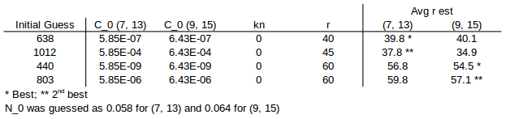
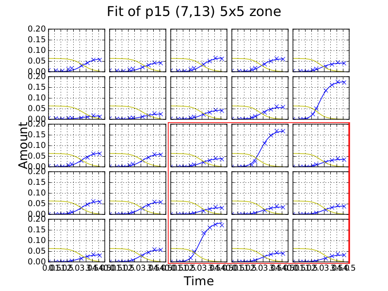
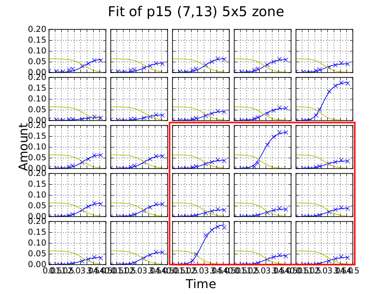
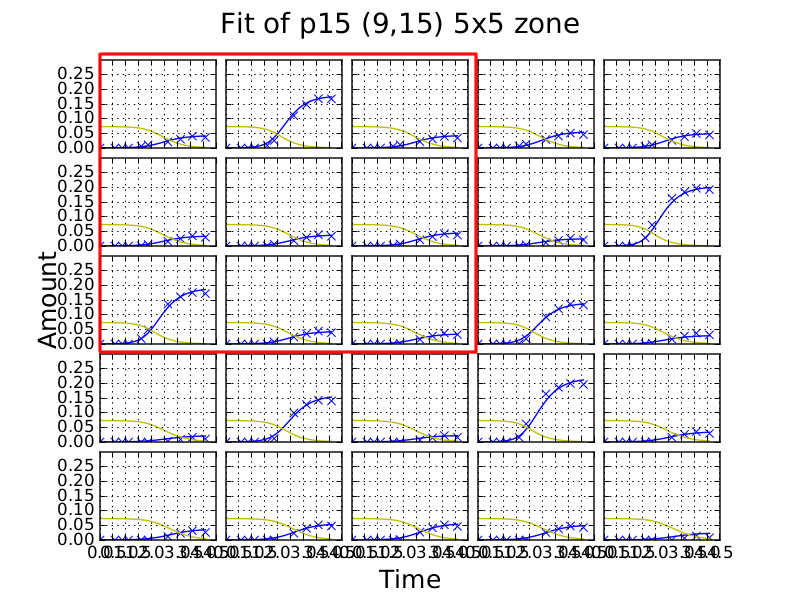
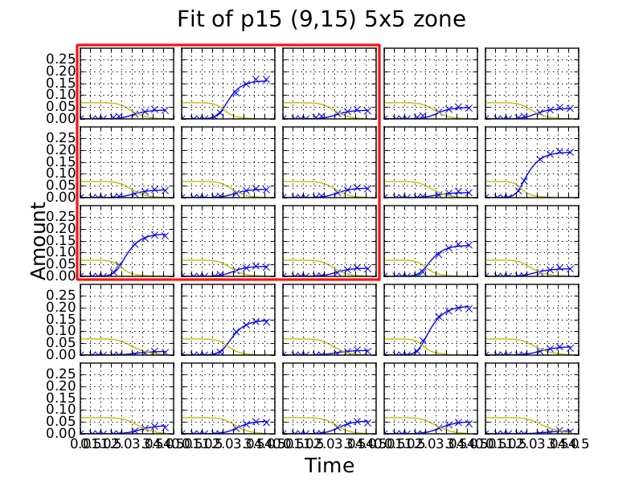
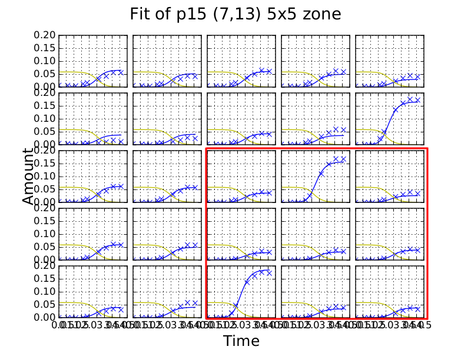

.. title: Fits of overlapping 5x5 zones
.. slug: fits-of-overlapping-5x5-zones
.. date: 2016-06-15 13:14:58 UTC+01:00
.. tags: 
.. category: 
.. link: 
.. description: 
.. type: text

Procedure
---------

I took cell measurement data from plate 15 for overlapping 5x5 zones
with top-left coordinates (7, 13) and (9, 15) where coordinates start
(0, 0). I guessed the initial amount of nutrients from the average of
final cell amounts just for the zone (i.e not full plate). I used a
10x11x11 grid of guesses for C_0, kn, and r. C_0 guesses are on a
logarithmic scale whereas kn and r guesses are on a linear scale (see
code below). I used the same r guess for all cultures in a single fit.

Code for grid of guesses:

.. code-block:: python
  :linenos:

  import numpy as np

  C_0s = np.logspace(-10, -1, 10)
  kns = np.linspace(0.0, 10.0, 11)
  rs = np.linspace(25.0, 75.0, 11)

I made bounds large in the hope that the best fits would not have any
estimates located at a boundary. I fit the competition model to both
zones using each of the 1000 initial guesses.

Results
-------

The table below contains estimates for the two best guesses for each
zone (totalling four for each zone). r_18 and r_6 are estimates of
growth constant for the same culture from different zones. This
culture is the central culture in the red area (representing the
overlap) in the plots at the bottom of the post.

.. image:: ../../images/fits-of-overlapping-5x5-zones/est_table.png

The two best fits for each zone have reasonable agreement in estimated
parameters. However we are hoping to find a global minimum where the
parameter estimates are, within the limits of accuracy of the
data/minimizer, the same and I am not sure that this is happening.

Agreement of parameter estimates between the two zones is fairly poor.

For zone (7, 13) estimates 440 and 803 produced N_0 guesses at the
lower bounds, highlighted in yellow.

The Effect of Boundaries
________________________

At the moment I include least squares fits of cell observations for
edge cultures in the objective function. Competition with cultures
outside of the boundary causes a discrepency between the actual
amount of nutrients in edge cultures and the amount of nutrients
predicted by fits of our model. There is also likely to be a net flux
of nutrients between the zone and the rest of the plate so when we
include all of the cultures in the objective function we incorectly
fix the total amount of nutrients in the zone (assuming growth runs
long enough to complete this is equal to the final amount of cells)
and this affects estimates of N_0 and in turn the other parameters. In
fits of zones, a buffer could be created by allowing parameters for
edge cultures to be estimated but without including measurements for
these cultures in the objective function.

In the current fits, I made guesses of N_0 from the zone, from which I
then determined bounds. If there is a buffer at the boundary, N_0 is
not so strongly coupled to the final cell observations and I can
instead use guesses and bounds for the plate rather than zone.

I have increased the speed of simulations significantly by vectorising
ode calculations using numpy (5x for full plate). We also have an even
faster simulation method using RoadRunner with models written in SBML
(50x faster again for a full plate). This should have translated into
a speed up of fitting so we could now also try fitting larger zones
where there is a smaller proportion of edge cultures. I could also fit
two overlapping zones on a simulated plate as verification.

Initial Guesses
_______________

Interestingly, the best fits all had initial guesses of zero for
kn. Estimates of C_0 were similar for each pair of best fits despite
very different initial guesses. Guesses or r were close or fairly
similar to the mean estimate for the plate.

I am not sure that the full parameter space is being explored by the
fitter. We could do with getting better initial guesses for r and/or using
a genetic algorithm/swarm.

Plots of Fits
-------------

Overlapping zones are indicated by red boxes with fits using the same
initial guess displayed side by side.

Guess 638
_________

Guess 1012
__________

Guess 440
_________

.. image:: ../../images/fits-of-overlapping-5x5-zones/coords_7_13_5x5_argv_440.png
   :width: 49%

Guess 803
_________

.. image:: ../../images/fits-of-overlapping-5x5-zones/coords_9_15_5x5_argv_803.png
   :width: 49%

Discussion
__________

Even the worst fits, with parameter guesses at the bounds, are
qualitatively quite close to timecourse data. However, parameters from
the two best fits for each zone are reasonably close so it looks like
we might have enough power to discern between mimima that are far
apart and recover reasonable estimates (i.e. there is not too much
noise in the data). Dealing better with boundaries might improve
agreement between the zones.

How can a Bayesian approach help us deal with local minima that are
far apart compared to a genetic algorithm?

..
  If we have two (or more) local minima, fairly far appart, that we are4
  unable to discern between, would a Bayesian aproach, where we instead
  estimate parameter distributions, be the best way to deal with this?
