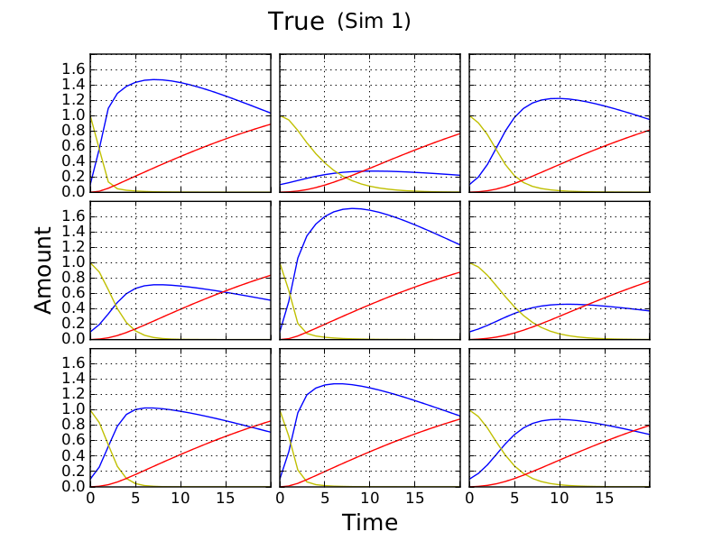
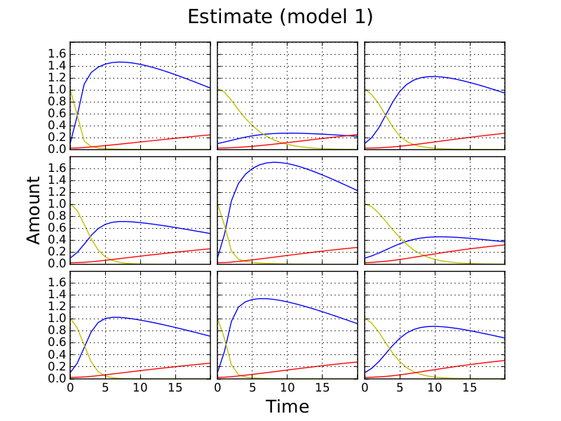
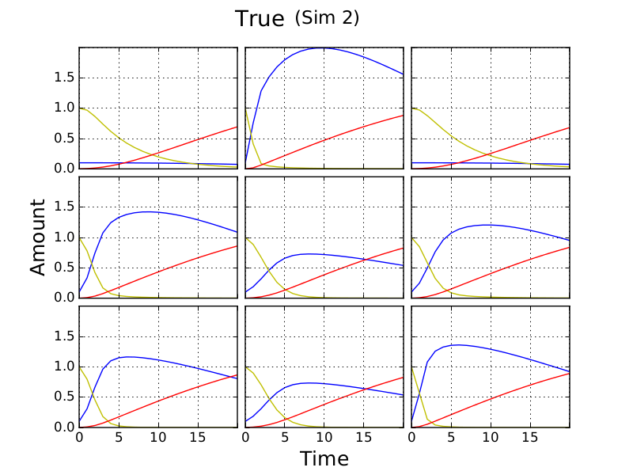
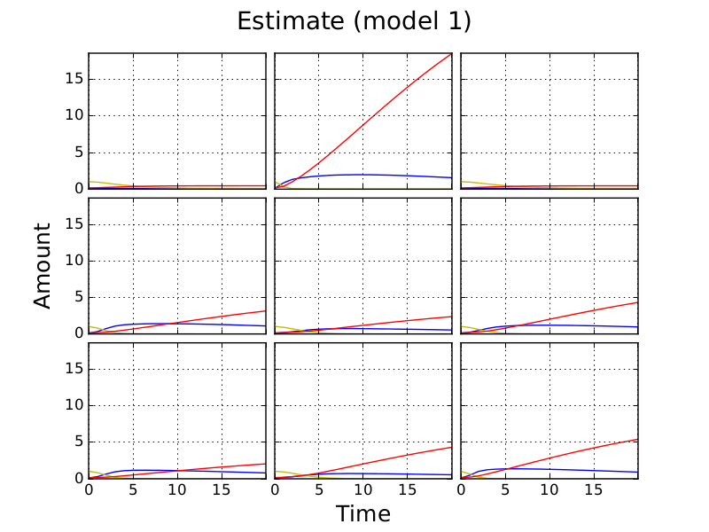
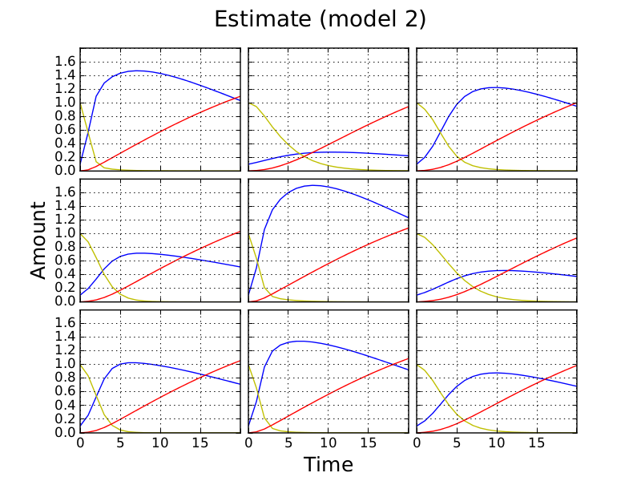
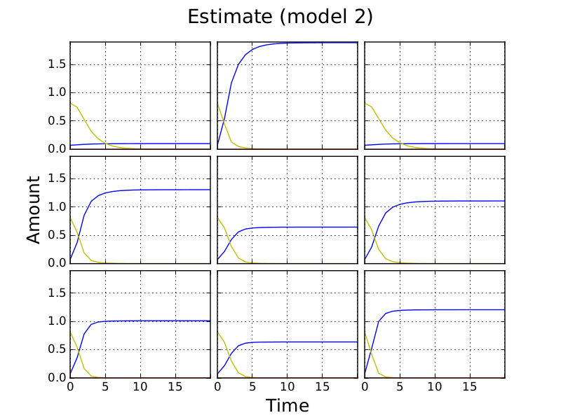

.. title: Least squares fit of simulated time-courses
.. slug: least-squares-fit-of-simulated-time-courses
.. date: 2016-04-28 18:33:17 UTC+01:00
.. tags: 
.. category: 
.. link: 
.. description: 
.. type: text

Outline
-------

Here I look at least squares fits of the CANS model to simulated CANS
data. I do this for two simulations of a 3x3 plate. In the first all
cultures have non-zero growth constants (r\ :sub:`i`); in the second
some of the cultures have zero growth constant. Of the three curves
plotted, only the amount of cells (blue) is used to recover
parameters. Simulations contain 21 time-points. This is an attempt to
keep fitting relevent to the data we will be using.

In the simulations rate constants are drawn from a N(1, 1)
distribution. I set other parameters manually.

I compare the perfomance of two fitting approaches. The first allows
constants for the secretion of signal by cells :math:`(\beta)` and the
effect of signal on cells :math:`(\alpha)` to vary beteen cultures; the
second does not.

The fixing of other parameters is sumarised below.

Plate level:

- C(t=0) - Initial cell amount
- N(t=0) - Initial nutrient amount
- S(t=0) - Initial signal amount
- k\ :sub:`n` - Nutrient diffusion constant
- k\ :sub:`s` - Signal diffusion constant

Culture level:

- r\ :sub:`i` - Growth constants

Culture level alpha and beta
----------------------------

Insert tables with deviations here

Plate level alpha and beta
--------------------------

Discussion
----------

Fits are better for plate level :math:`\alpha` and :math:`\beta`.

If one or more cultures on a plate has a zero growth constant (r),
then fits are worse.

This may not be the case for different parameters (particularly ks).

We should also compare how well the independent model recovers rate
constants.
