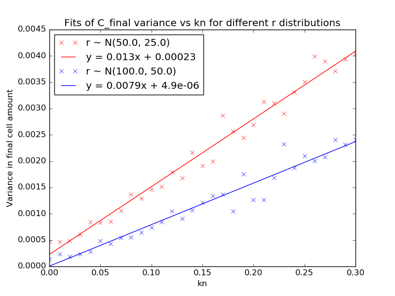

.. title: Make a Guess
.. slug: make-a-guess
.. date: 2016-05-22 10:13:19 UTC+01:00
.. tags: 
.. category: 
.. link: 
.. description: 
.. type: text

Guess C_0 and N_0
-----------------

If growth is more or less complete then this is easy. N_0 is the
average final cell amount (given small C_0). We know the typical
dilution used in experiments; 1:10,000 for ditiulted cultures
(i.e. C_0 ~ N_0/10,000 or could just take average C_f of growers
rather than use N_0).

Guess kn
--------

More difficult

Might be possible if we can make good enough guesses of growth
constants r and simulate for different kns.

Guess r
-------

Try fitting a simpler model. Then can guess kn.

Fit a smaller zone
++++++++++++++++++

1. Try to fit either a 3x3 or 5x5 zone around each cultures using the
   competition model.

2. Simplified model with linear diffusion term could be good enough
   for guesses and would be fast. Fit each culture individually. k is
   culture, not plate, level.

   dC/dt = rCN

   dN/dt = -rCN + k

3. Arbitrary neighbours? Finite reservoirs? N_low and N_high.

   N = -rCN -k_1(N-N_l) -k_2(N-N_h)

   N_l_0 = 0; N_h_0 = ?; Too many loose params?

- 2. seems most practical to implement but there might be merit
  in 1. if this doesn't work.
