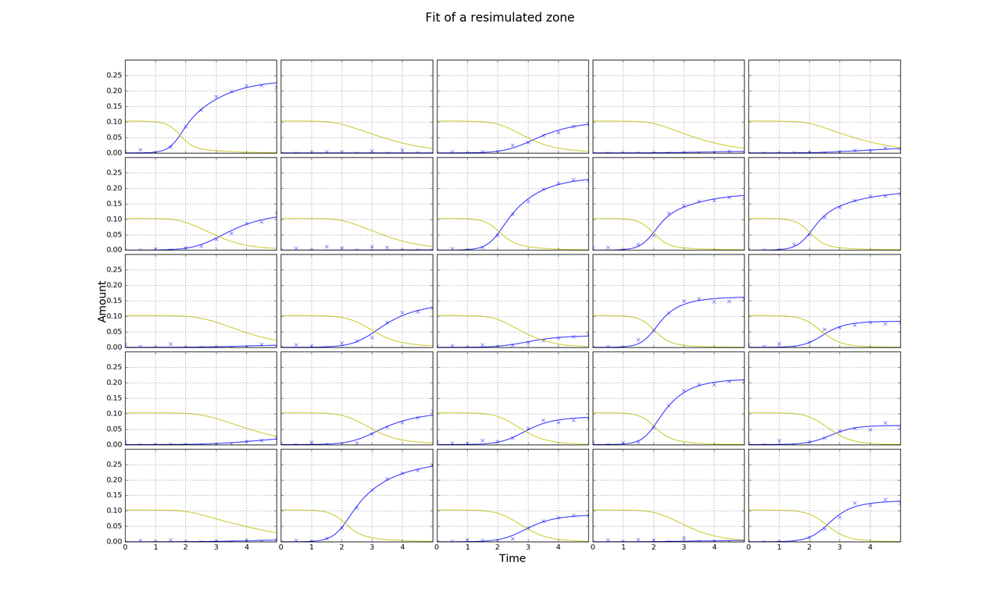

.. title: Make a Guess
.. slug: make-a-guess
.. date: 2016-05-22 10:13:19 UTC+01:00
.. tags: 
.. category: 
.. link: 
.. description: 
.. type: text

Guess C_0 and N_0
-----------------

If growth is more or less complete then this is easy. N_0 is the
average final cell amount (given small C_0). We know the typical
dilution used in experiments; 1:10,000 for ditiulted cultures
(i.e. C_0 ~ N_0/10,000 or could just take average C_f of growers
rather than use N_0).

Guess kn
--------

More difficult

.. image:: ../../images/make-a-guess/c_f_var_vs_kn.png
   :width: 100%

Might be possible if we can make good enough guesses of growth
constants r and simulate for different kns.

Guess r
-------

Try fitting a simpler model. Then can guess kn.

Fit a smaller zone
++++++++++++++++++

1. Try to fit either a 3x3 or 5x5 zone around each cultures using the
   competition model.

2. Simplified model with linear diffusion term could be good enough
   for guesses and would be fast. Fit each culture individually. k is
   culture, not plate, level.

   dC/dt = rCN

   dN/dt = -rCN + k

3. Arbitrary neighbours? Finite reservoirs? N_low and N_high.

   N = -rCN -k_1(N-N_l) -k_2(N-N_h)

   N_l_0 = 0; N_h_0 = ?; Too many loose params?

- 2. seems most practical to implement but there might be merit
  in 1. if this doesn't work.

Fitting
-------

It was important to rescale C_0 to a similar value as N_0 in order for
the minimizer to work.

Until we get to a 7x7 grid there are more edge than internal cultures.

Below shows fitting of a zone from the midle of a simulated 16x24
plate. In the first figure amounts have been resimulated from the true
parameters and are as they would be if the zone was not part of a
larger plate. In the second the amounts from the larger plate have
fitted without adjustment.

.. image:: ../../images/make-a-guess/fit_of_isolated.png

Guesses from individual fits of the independent model are poor
--------------------------------------------------------------

.. image:: ../../images/make-a-guess/indi_inde_fits.png

Using individual fits of the independent model, cultures with the
greatest r's are estimated to have the smallest r's.

Inde model: dC/dt = rNC, dN/dt = -rNC.

In the independent model N_0 must be equal to the final cell amount
for each culture. If there are more nutrients, for the same r, the
reaction should complete in less time. In the competition model N_0 is
equal for all cultures, so reactions with greater r are not
substantially quicker. This is why the independent model provides poor
estimates.

An initial guess of r = 20 was used for all. C_0 was estimated from
the average of final cell amounts and knowledge about the ratio
(1:1000) and used as a fixed constraint.

True r: 55.7, 22.6, 20.7, 33.8, 38.8, 08.0, 12.3, 31.9, 53.6

Est  r: 18.8, 20.0, 20.0, 62.1, 20.8, 20.0, 20.0, 52.6, 18.9

Power Series Model
------------------

The idea is to allow N to vary arbitrarily so as to produce a good fit for C with the hope that the arbitrary N is close to truth.

We keep C_0 and N_0 fixed according to the guesses and fit the following model.

dC/dt = rNC

dN/dt = -rNC + k1 + k2*t

True: 33.1, 11.5, 42.7, 30.8, 44.2, 56.7, 19.2, 15.7, 32.7

Est:: 32.6, 20.0, 42.9, 32.7, 42.7, 57.7, 20.0, 20.0, 30.4

Bounds must also be applied to k1 and k2. If they are not, then
estimates of r do not stray very far from the initial guess and the
timecourse of N_0 poorly matches the truth. Bounds could be generated
w.r.t N_0 so that dN/dt is never too large. It would be good to
constrain dN/dt to be always less than zero but I haven't figured out
how to do so.

Unbounded k1 and k2:

.. image:: ../../images/make-a-guess/power_series_fit_k1_k2_unbounded.png

Neighbour Model
---------------

To incorporate diffusion more realistically I created a model in which
the a culture has two neighbours: a zero grower and a fast grower. All
cultures begin with the same amounts of nutrients and cells, derived
from guesses. I allow diffusion constants between each neighbour to
differ.

Model equations:

Zero growing reservior:

dC1/dt = 0

dN1/dt = - kn1(N1 - N)

Real culture:

dC/dt = rNC

dN/dt = -rNC - kn1(N - N1) - kn2(N - N2)

Fast growing reservior (r2 = 40.0):

dC2/dt = r2*N2*C2

dN2/dt = -r2*N2*C2 - kn2(N2 - N)

Free Parameters: kn1, kn2, r

True r: 24.4, 2.9, 8.2, 17.0, 8.6, 15.9, 39.7, 14.0, 39.3

Est r: 26.0, 23.0, 24.2, 16.4, 19.8, 24.7, 42.9, 21.1, 48.4

Below is a better fitting example using the same model but a different
simulated plate.

True r: 15.6, 15.1, 40.3, 7.2, 28.0, 0.0, 27.7, 8.3, 37.2

Est r: 18.7, 22.0, 38.8, 22.2, 27.3, 9.4, 28.2, 14.8, 36.3

The total amount of nutrients that the culture can take from its
neighbours is a limiting factor for this model. In the competition
model, the culture could feasibally take all of the nutrients from
each of its four neighbours (more with futher diffusion), whereas in
the above model there is only access to nutrients from the one slow
growing culture (assuming growth is no faster than the fast growing
neighbour). The scenario is similar for loss of nutrients to fast
growing cultures. Incorporating more fast and slow growing neighbours,
which could use the same kn- and kn+ (i.e. having larger reservoirs),
could solve this issue.

This is easily acomplished by adding a factor for the number of
identical neighbours + or - into only the real culture rate
equation. E.g. for 2 of each type of neighbour...

Real culture:

dN/dt = -rNC - 2*kn1(N - N1) - 2*kn2(N - N2)

Resultant fits:

1 of each
+++++++++

True r: 47.8, 0.0, 29.3, 32.9, 27.0, 3.54, 18.8, 43.6, 11.7

Est r: 47.4, 14.4, 29.9, 31.7, 25.4, 23.1, 26.8, 60.0, 13.2

2 of each
+++++++++

True r: 47.8, 0.0, 29.3, 32.9, 27.0, 3.54, 18.8, 43.6, 11.7

Est: 42.5, 4.87, 30.5, 35.4, 26.2, 24.2, 25.1, 42.3, 13.8

3 of each
+++++++++

True r: 47.8, 0.0, 29.3, 32.9, 27.0, 3.54, 18.8, 43.6, 11.7

Est r: 39.2, 16.0, 30.8, 30.6, 27.4, 24.3, 28.3, 43.0, 14.0

4 of each
+++++++++

True r: 47.8, 0.0, 29.3, 32.9, 27.0, 3.54, 18.8, 43.6, 11.7

Est r: 38.9, 16.7, 36.9, 30.6, 26.5, 24.4, 28.1, 42.5, 14.2

For most cases two of each type of neighbour shoule be good enough.

There is a problem in distinguishing slow growers from cultures with
strong growing neighbours which only the full competition model with a
plate level diffusion constant can hope to solve.

The power series and neighbour models work as good guesses because of
the strong coupling of N and C amounts in the (nutrient only)
competition model. If we start adding extra species such as signal and
arrested cells, I'm not sure how good/(complex) this approach would
be.

At some point it might just be easier to fit the competion model for
3x3 sections on each plate but this might require a guess for kn.
