.. title: Using Independent Estimate as Initial Guess for Competition Fits
.. slug: use-inde-est-as-comp-guess
.. date: 2016-05-05 18:27:11 UTC+01:00
.. tags: 
.. category: 
.. link: 
.. description: 
.. type: text

Outline
-------------

I study a competition model simulation of a 3x3 plate for which
fitting of the competition model is inaccurate. I attempt to improve
fits using independent model estimates of parameters as starting
points for fits of the competition model. I vary the nutrient
diffusion constant, kn, while keeping other parameteres fixed and
observe the effect on fitting.

This suceeds at kn up to 0.12. Above this value, the independent
solution is a local minimum.

Uniform starting points provide good fits for 0.02 <= kn <=
0.20. Other ranges were not stuidied except for the case kn=0.

In the Next post I will try several random sets of starting rs.

Uniform fit k\ :sub:`n` = 0
---------------------------

The below fits use a uniform initial parameter guess. True rate
constants ~N(1,1); all rate constant guesses are of value 1.

.. image:: ../../images/use-inde-est-as-comp-guess/uni_kn_0_00/truth_0.png
   :width: 32%
.. image:: ../../images/use-inde-est-as-comp-guess/uni_kn_0_00/inde_est_0.png
   :width: 32%
.. image:: ../../images/use-inde-est-as-comp-guess/uni_kn_0_00/comp_est_0.png
   :width: 32%

The independent model provides a good fit to the competition model
simulation but the competition model overestimates the values of kn.

Uniform starting points for other values of k\ :sub:`n`
-------------------------------------------------------

For the same set of rate constant parameters, competition fits are
good when using uniform guesses of growth constant and k\ :sub:`n`\
>0. On the other hand parameter estimates from independent fits are
poor. Plots for the next kn value above zero and maximum simulated are
shown below. Fits using itermediate kn values were simillarly good for
the competition model and poor for the independent model.

.. image:: ../../images/use-inde-est-as-comp-guess/uni_kn_0_02/truth_uniform_kn_1.png
   :width: 32%
.. image:: ../../images/use-inde-est-as-comp-guess/uni_kn_0_02/inde_est_uniform_kn_1.png
   :width: 32%
.. image:: ../../images/use-inde-est-as-comp-guess/uni_kn_0_02/comp_est_uniform_kn_1.png
   :width: 32%

inde r MAD 0.2846154083

comp r MAD 2.26275002272E-006

comp kn estimate 0.019999988

.. image:: ../../images/use-inde-est-as-comp-guess/uni_kn_0_20/truth_uniform_kn_0_20.png
   :width: 32%
.. image:: ../../images/use-inde-est-as-comp-guess/uni_kn_0_20/inde_est_uniform_kn_0_20.png
   :width: 32%
.. image:: ../../images/use-inde-est-as-comp-guess/uni_kn_0_20/comp_est_uniform_kn_0_20.png
   :width: 32%

inde r MAD 0.7212100963

comp r MAD 2.60634831801E-006

comp kn estimate 0.1999999667

For other values of kn we found that uniform parameter guesses
provided good fits. However, for other true parameters this may not be
the case. We therefore look below at the performace of random
parameter guesses and higher values of kn. The main drawback of this
approach is that it increases the amount of computation time
required. However, it may be neccessary to use it.

Using independent estimates as the starting point for competition fitting
-------------------------------------------------------------------------

This can be much faster when kn is small. For the rate constant
parameters used, good parameter estimates were recovered for k\
:sub:`n` <= 0.12. Above this value the the competition fit was unable
to escape the independent estimate minimum.

Importantly, we can fit the competition model to competition
simulations with k\ :sub:`n`\ =0 using this method.

kn = 0

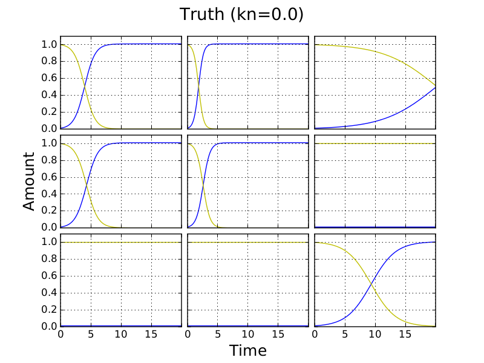
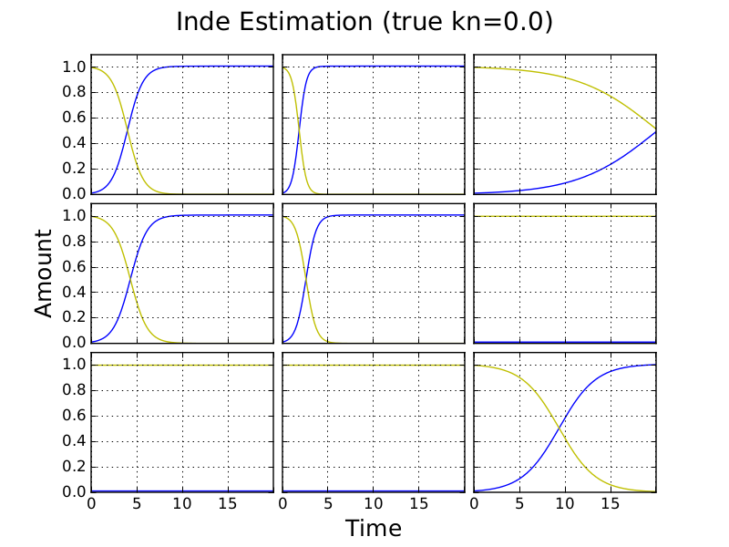

kn = 0.12

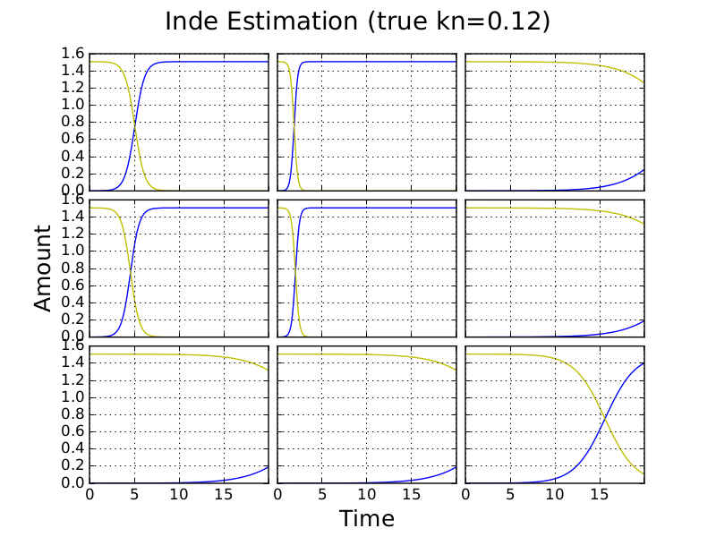

kn = 0.14

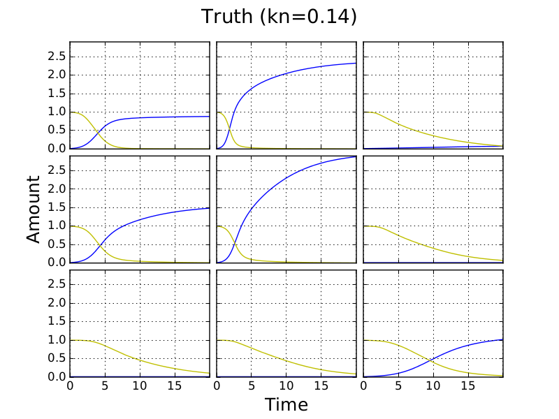
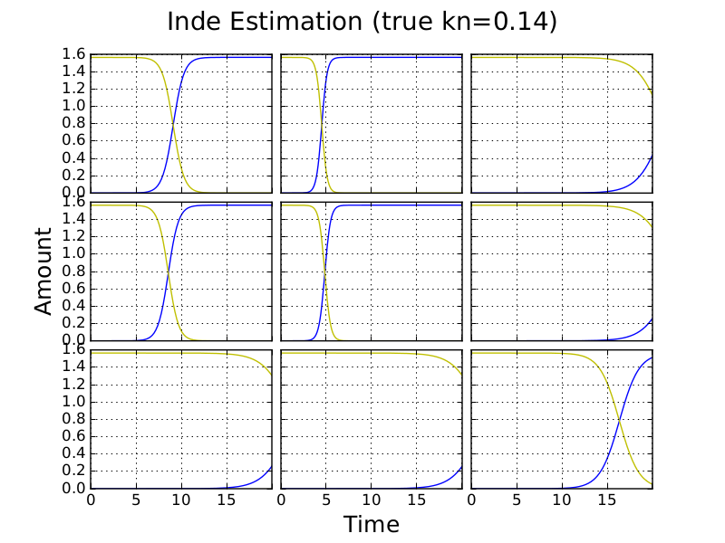
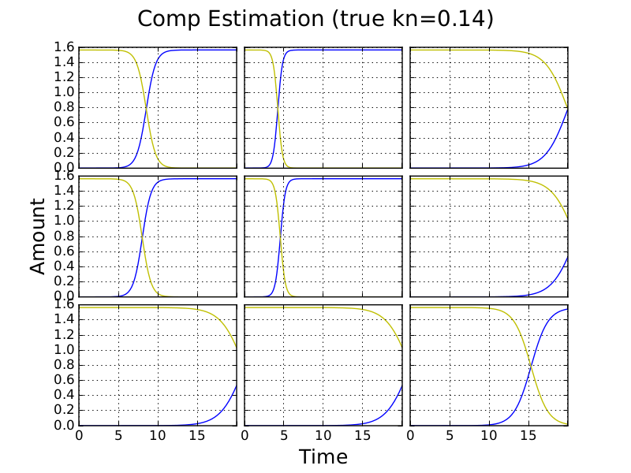

Using randomised starting points for independent and competition fitting
------------------------------------------------------------------------

Below we use 3 different random sets of initial guesses in fits of the
competition and independent models to competition simulations.

kn = 0

Below are three estimates using different random initial guesses. Only
the first two provide good fits. These beat the uniform guess above
and provide similar accuracy to fitting using the independent estimate
as a start.

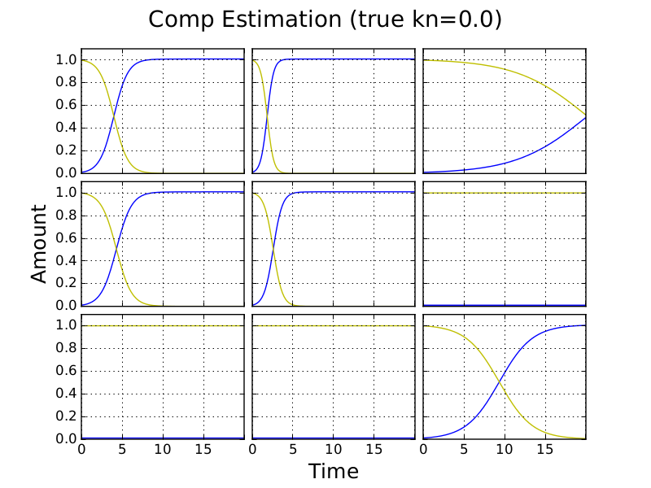

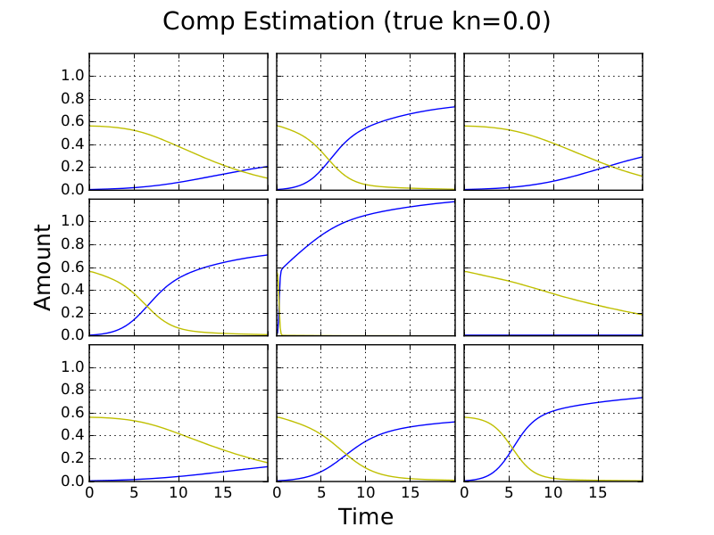

kn = 0.02

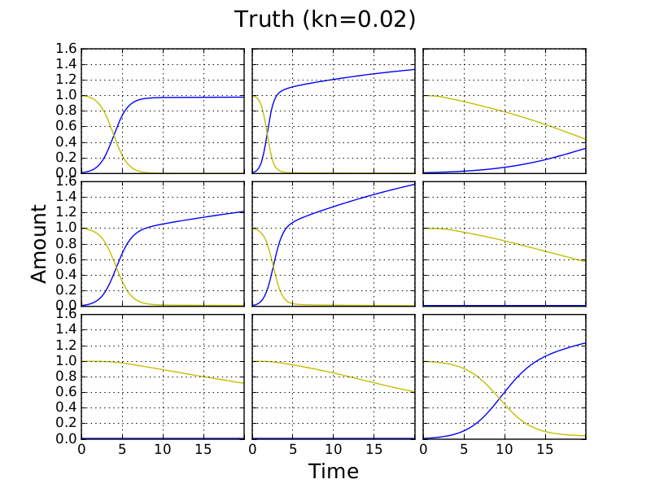

Only the first set of random starting parameters provides a good fit.

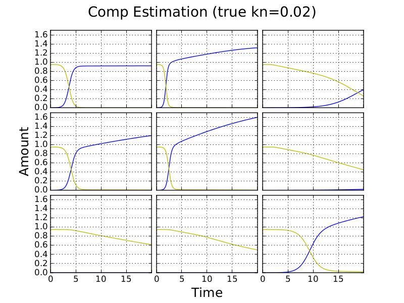
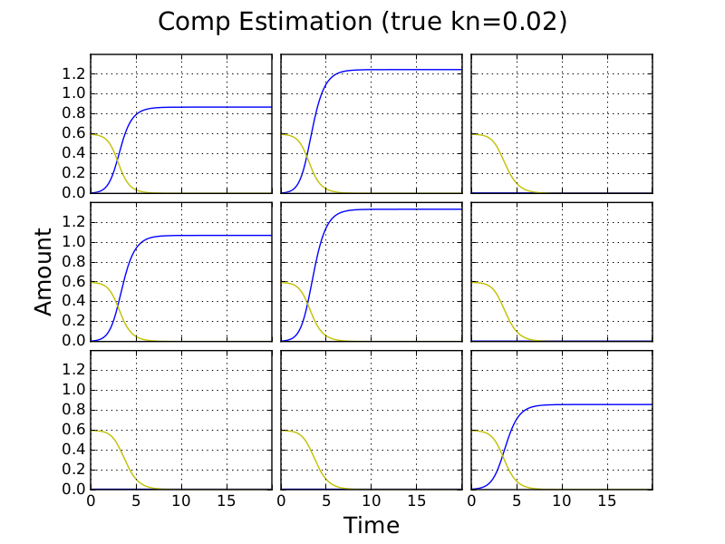
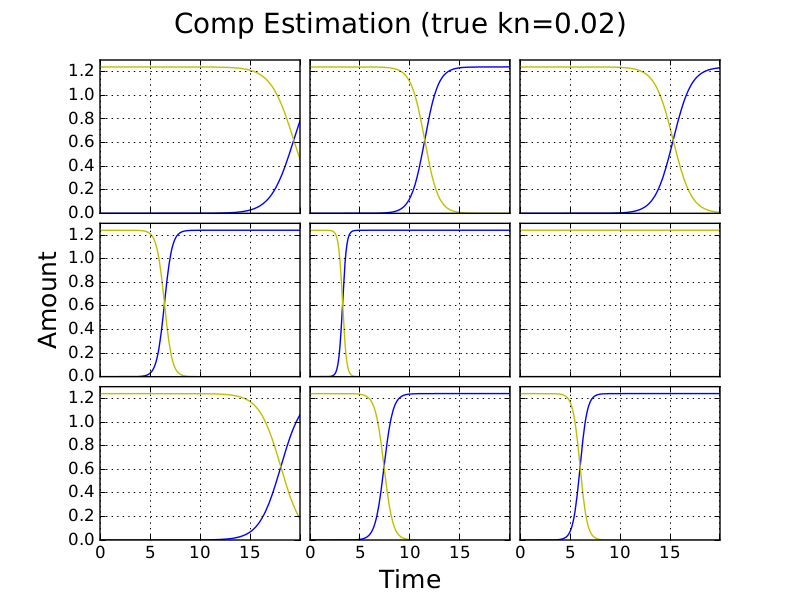

kn = 0.12

Now, only the second set of random starting parameters provides a good fit.

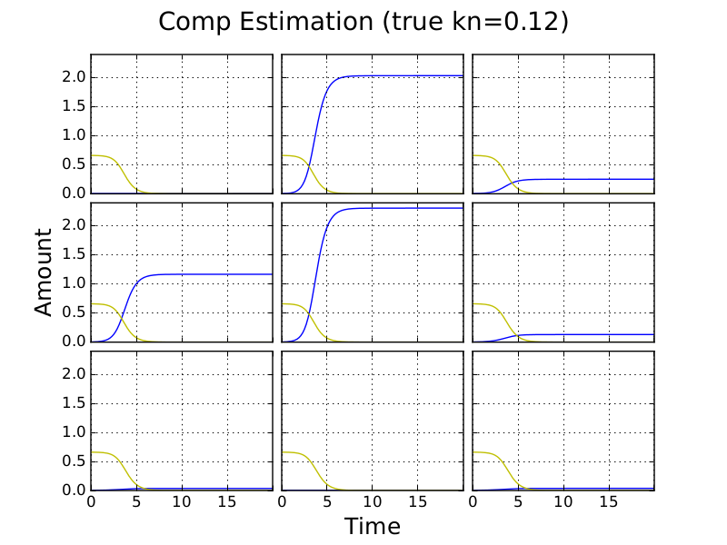

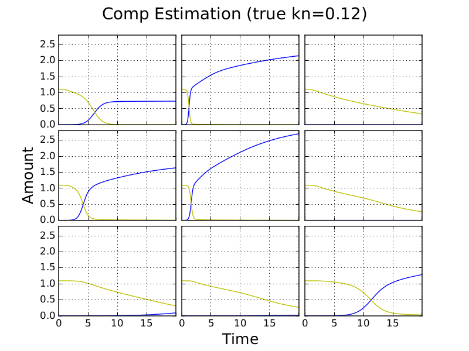

kn = 0.18

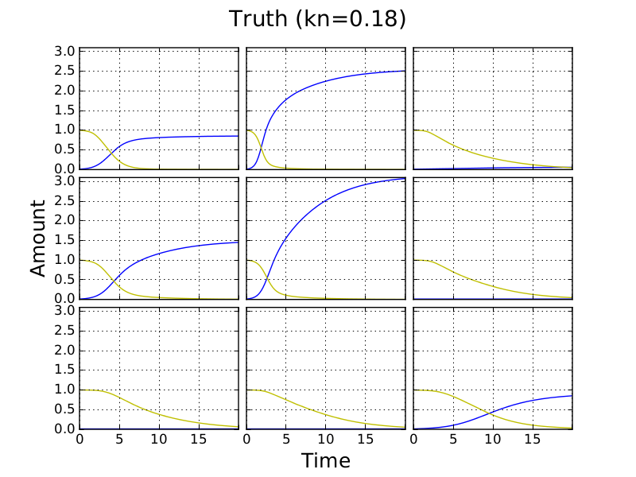

This is the only value of kn for which the third set provides a good
estimate (I'm pretty sure). Here it recovers r parameters with the
highest accuracy.

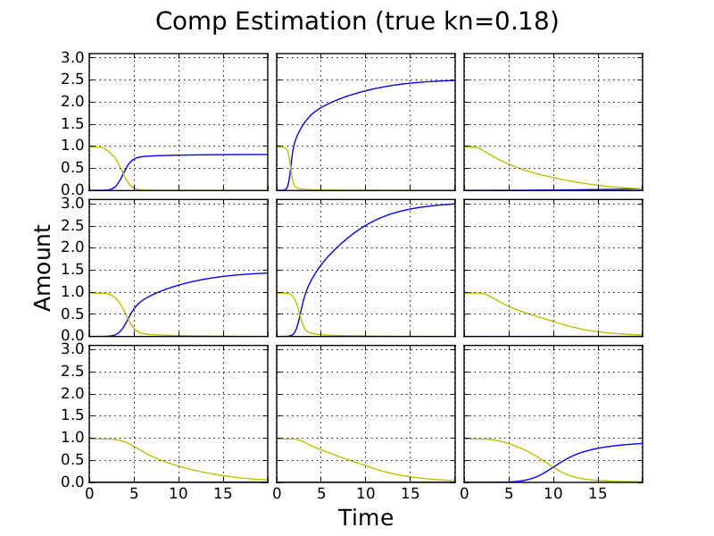
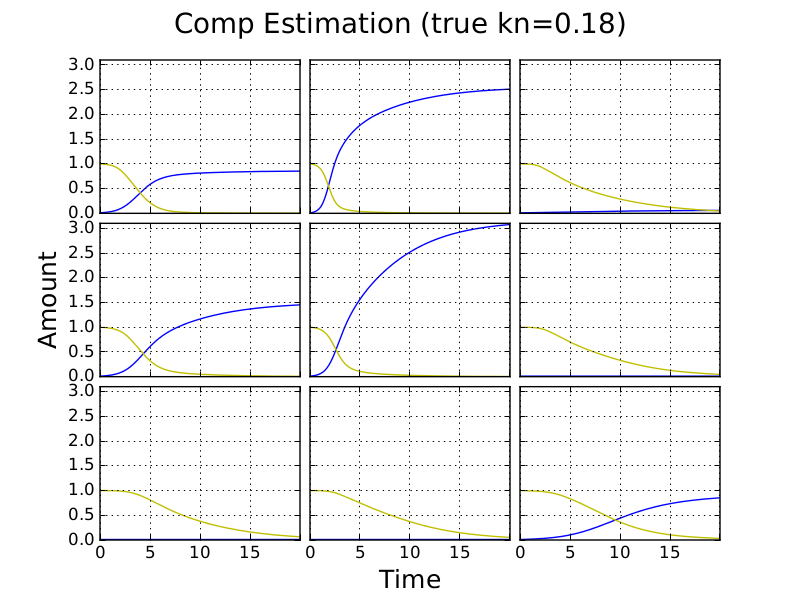

Surprisingly, different initial guesses result in the best fit at
different values of k\ :sub:`n`. One set may provide the best fit at
multiple separate regions of kn value.

Do we achieve good fits with at least one of these sets at every kn?
It looks that way from the plots.

Discussion
----------

This approach speeds up fitting becuase the starting point of
competition fitting is already close to a minimum. Full plate fitting
of the independent model remains slow becuase we are treating C(t=0)
and N(t=0) as shared parameters (i.e. the same for each culture on the
plate) and there is therefore only one less parameter in independent
fitting than in competition fitting. It would be worth seeing if we
can speed up fits by first treating C(t=0) and N(t=0) as independent
for each culture, fitting with the independent model for each culture,
and then using the results of these fits in a second round of
independent fitting where C(t=0) and N(t=0) are shared. Independent
estimates could then be used as starting points for competition
fits. Results above suggest that this would work so long as kn is
relatively small.

When it is not appropriate to use independent estimates as the
starting pionts for competition estimates (i.e. when kn is relatively
large), we may use the competition model to first fit small segments
of a plate and use estimates from these fits as starting points for
fitting of increasingly larger segments up to the plate level.
