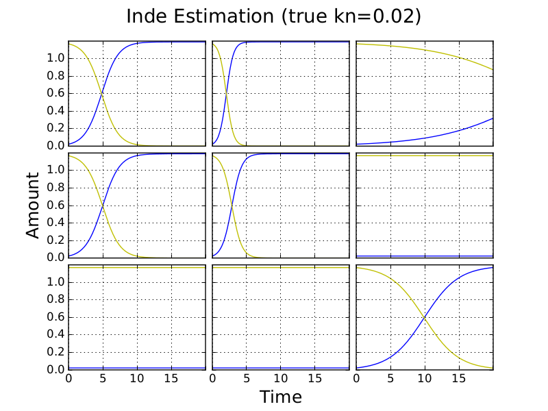

.. title: Using Independent Estimate as Initial Guess for Competition Fits
.. slug: use-inde-est-as-comp-guess
.. date: 2016-05-05 18:27:11 UTC+01:00
.. tags: 
.. category: 
.. link: 
.. description: 
.. type: text

Outline
-------------

I study a competition model simulation of a 3x3 plate for which
fitting of the competition model is inaccurate. I attempt to improve
fits using independent model estimates of parameters as starting
points for fits of the competition model. I vary the nutrient
diffusion constant, kn, while keeping other parameteres fixed and
observe the effect on fitting.

This suceeds at kn up to 0.12. Above this value, the independent
solution is a local minimum.

In the Next post I will try several random sets of starting rs.

Uniform fit k\ :sub:`n` = 0
---------------------------

The below fits use a uniform initial parameter guess. True rate
constants ~N(1,1); all rate constant guesses are of value 1.

.. image:: ../../images/use-inde-est-as-comp-guess/uni_kn_0_00/inde_est_0.png
   :width: 32%

The independent model provides a good fit to the competition model
simulation but the competition model overestimates the values of kn.

Uniform starting points for other values of k\ :sub:`n`
-------------------------------------------------------

For the same set of rate constant parameters, competition fits are
good when using uniform guesses of growth constant and k\ :sub:`n`\
>0. On the other hand parameter estimates from independent fits are
poor.

.. image:: ../../images/use-inde-est-as-comp-guess/uni_kn_0_02/truth_uniform_kn_1.png
   :width: 32%

.. image:: ../../images/use-inde-est-as-comp-guess/uni_kn_0_02/comp_est_uniform_kn_1.png
   :width: 32%

inde r MAD 0.2846154083

comp r MAD 2.26275002272E-006

comp kn estimate 0.019999988

inde r MAD 0.7212100963

comp r MAD 2.60634831801E-006

comp kn estimate 0.1999999667

Using independent estimates as the starting point for competition fitting
-------------------------------------------------------------------------

Using randomised starting points for independent and competition fitting
------------------------------------------------------------------------

Discussion
----------

This approach speeds up fitting becuase the starting point of
competition fitting is already close to a minimum. Full plate fitting
of the independent model remains slow becuase we are treating C(t=0)
and N(t=0) as shared parameters (i.e. the same for each culture on the
plate) and there is therefore only one less parameter in independent
fitting than in competition fitting. It would be worth seeing if we
can speed up fits by first treating C(t=0) and N(t=0) as independent
for each culture, fitting with the independent model for each culture,
and then using the results of these fits in a second round of
independent fitting where C(t=0) and N(t=0) are shared. Independent
estimates could then be used as starting points for competition
fits. Results above suggest that this would work so long as kn is
relatively small.

In the next blog post I study whether better fits can be achieved
using multiple randomised starting points. I am particularly
interested in how this works for large kn where the above method
fails.
