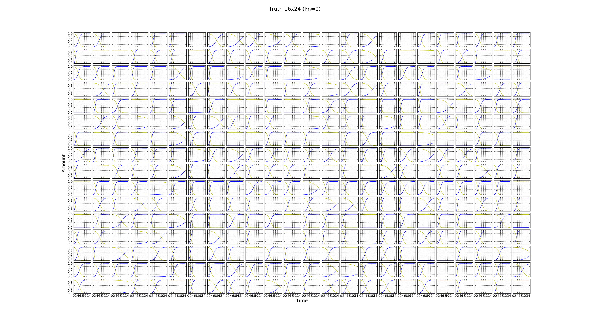
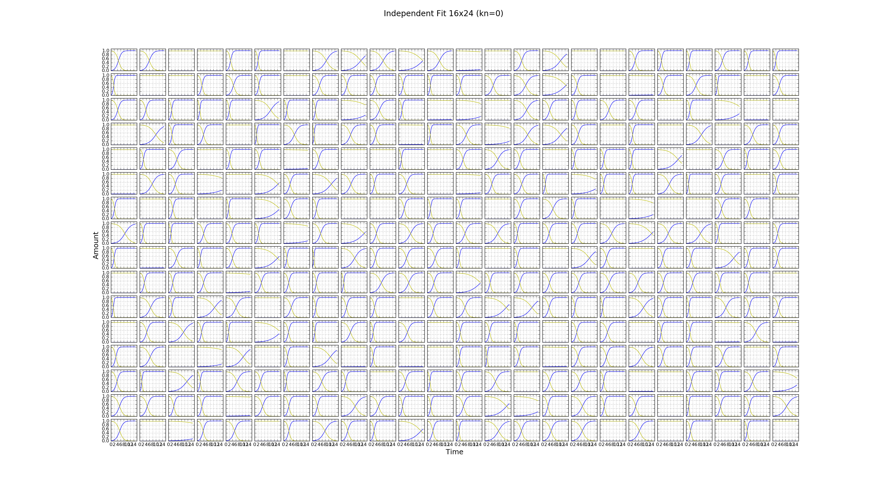

.. title: Successful full plate independent fit
.. slug: successful-full-plate-independent-fit
.. date: 2016-05-06 12:33:14 UTC+01:00
.. tags: 
.. category: 
.. link: 
.. description: 
.. type: text

Outline
-------

In a previous blog post I did not recover good fits of competition
model simulations with zero nutrient diffusion constant kn
(equivlalent to the indepenent model). This was worrying when fitting
the independent model. I had not realised that minimization was
stopping early due to a limit on the maximum number of function
evaluations. Here I show that, with better stopping criteria, the
independent model can be fit to the simulation data. Data was
simulated for 21 equally space timepoints which is comparable to
experiment.

Results
-------

Discussion
----------

We can successfully fit a whole plate using the independent
model. This is likely to be true for the competition model as well if
we use techniques described in the previous blog post but we should
check this.

Using default options for the minimization, except for the maximum
number of function evaluations which was unlimited, fitting was very
slow.

I should have saved parameters and values of the objective
function every 100 iterations or so. This would have allowed me to
determine how long the simulations should run for in order to reach a
minimum with the required level of accuracy.

Estimates should be accurate enough to determine whether the
independent or competition model provides a better fit by comparing
the consistancy of growth constant estimates for identical
strains. Ideally errors in growth constant estimates should be small
compared to the range of their distribution. In simulations, without
experimental noise but with a similar number of observations, we can
recover growth constants to a high precision. Here the MAD of r
estimates from truth was of order 10E-4 with true parameter values
ranging 0 - 4.54.

Biological variance in growth constants between identical strains will
also be present in real data.
