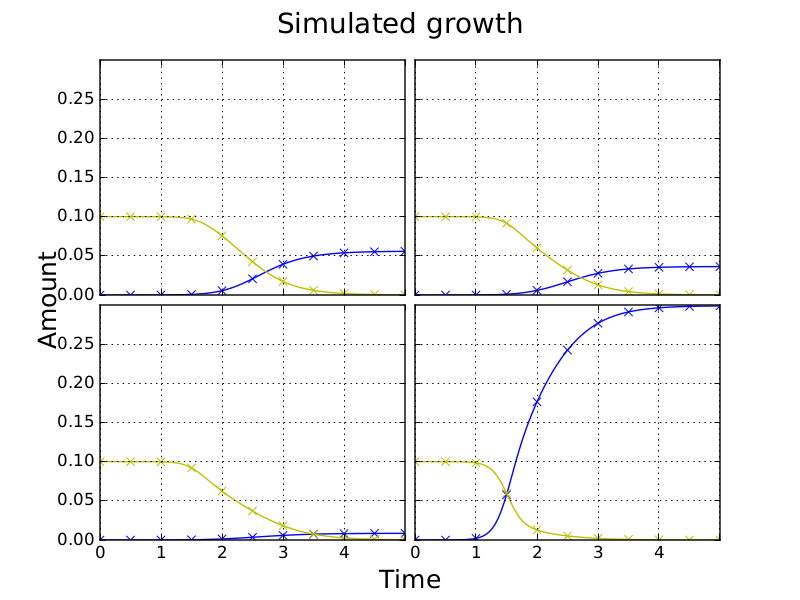
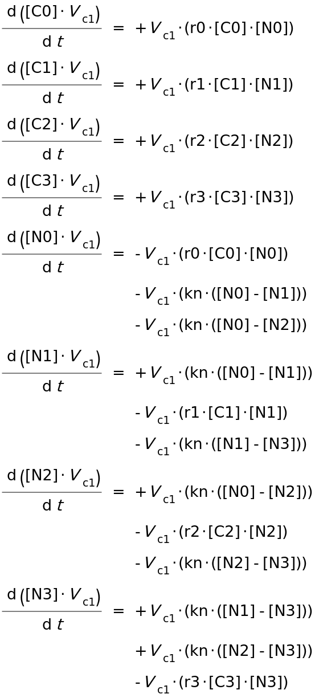

.. title: Writing models in SBML
.. slug: writing-models-in-sbml
.. date: 2016-06-10 09:35:35 UTC+01:00
.. tags: 
.. category: 
.. link: 
.. description: 
.. type: text

Generating an SBML model in Python using libsbml
------------------------------------------------

Using the `libSBML Python API
<http://sbml.org/Software/libSBML/docs/python-api/>`_ we are now able
to generate SBML models for the competition model for any Plate size,
given instances of CompModel and a Plate with parameter data. `Here
<link:/listings/simulated_2x2_plate.xml.html>`_ is an example of the
xml generated for a simulated 2x2 plate with plots generated using
both CANS (and SciPy's odeint solver (not from SBML)) and Copasi
shown below.

.. image:: ../../images/writing-models-in-sbml/copasi_2x2_sim.png

Copasi generates the below ODEs from the reaction equations in the
table. Diffusion reactions are irreversible with rate kn*(N[i] - N[j])
for culture numbers i < j.

.. image:: ../../images/writing-models-in-sbml/reaction_table_2x2.png

With SBML we can now distribute versions of our model in a standard
format and these can contain parameter estimates from fitting. The
SBML models can be simulated using tools such as `Copasi
<http://copasi.org/>`_ and `libRoadRunner
<http://libroadrunner.org/>`_. Currently it takes us days to fit a
whole plate using CANS and SciPy. If the solvers/fitters for other
tools are faster than what we are currently doing, we will be able to
speed up our code using the APIs. Unfortunately libRoadRunner's and
Copasi's Python bindings are only availible in Python 2 so we may have
to rewrite some of our code. Also, neither are on pypi. The `Copasi Python
bindings <http://copasi.org/Support/Installation/Language_Bindings/>`_
are a work in progress and not well documented but there are `examples
<https://github.com/copasi/COPASI/tree/master/copasi/bindings/python/examples>`_
on GitHub. There is also currently `no download
<http://software.opensuse.org/download.html?project=home%3Afbergman%3ACOPASI&package=python-copasi>`_
for Ubuntu 16.04.

`libroadrunner installation instructions <http://libroadrunner.org/install/>`_

`libroadrunner python bindings <https://sourceforge.net/projects/libroadrunner/files/libroadrunner-1.3/>`_

We may need to use a genetic algorithm in order to find the global
minimum. For this we could use the Python package `Inspyred
<http://pythonhosted.org/inspyred/>`_. I am also going to look at how
we can conduct Bayesian inferrence using `pySTAN
<https://pystan.readthedocs.io/en/latest/>`_.
